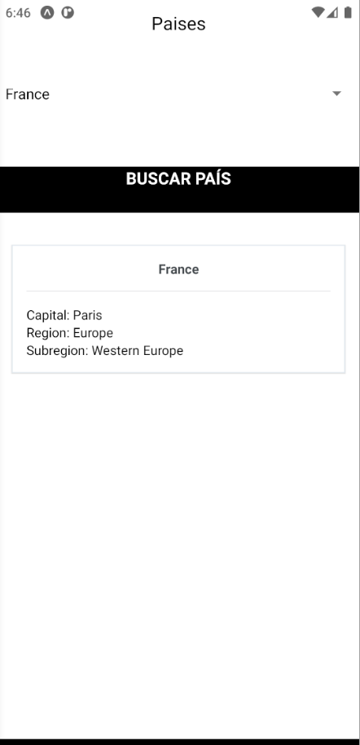

# Guía 8

Lo desarrollado en esta guía consiste en:
- Desarrollo consiste en hacer un GET a la API, la cual se cambió ya que la presentada en la guía, actualmente no respondía.
- Discución de resultados, fue cargar en el **Picker** los países dinámicamente por medio de otro endpoint.

Ambos desarrollados con expo, para probar

1. Descargar el repo
2. yarn install
3. yarn start

---

## navegacion

Búsqueda de información del país|Paises para seleccionar cargados desde API
:---------:|:---------:
|
