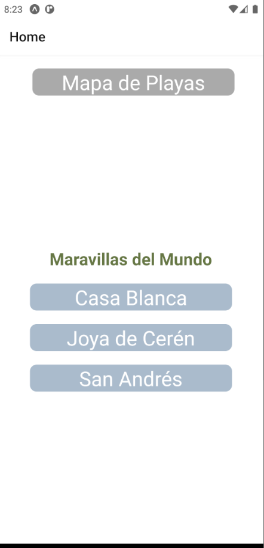
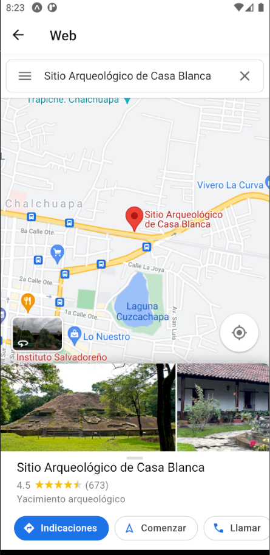
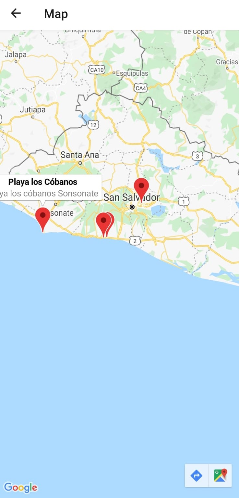
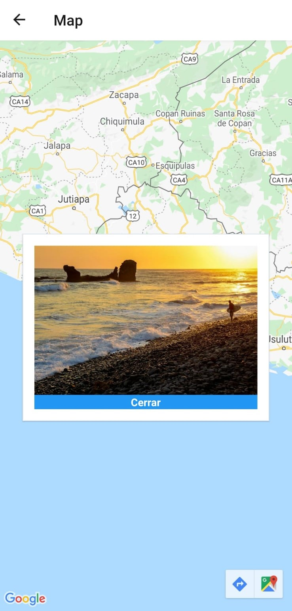
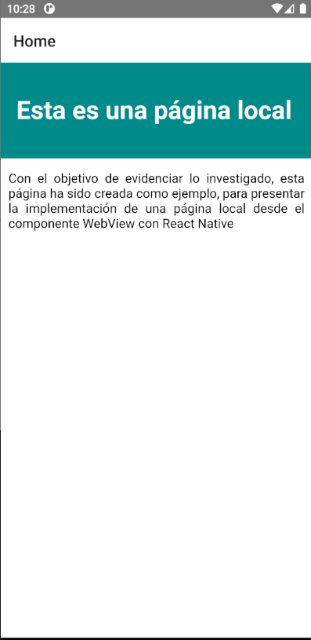

# Guía 8

Los proyectos para esta guía corresponden de la siguiente manera
- **sitios**: Desarrollo de guía 7
- **WebView local**:   Discución de resultados

Ambos desarrollados con expo, para probar

1. Descargar el repo
2. yarn install
3. yarn start

---

## sitios

captura 1|captura 2
---------|---------
|
|

---
## WebView Local

Para poder cargar HTML de manera local en el componente WebView se ha creado un nuevo proyecto, pero nativo de android con **react-native init my-app**. Desde android se lee este tipo de archivos locales desde la siguiente ruta ***webviewlocal>android>app>src>main>assets>local.html*** 

fuente: https://aboutreact.com/load-local-html-file-url-using-react-native-webview/