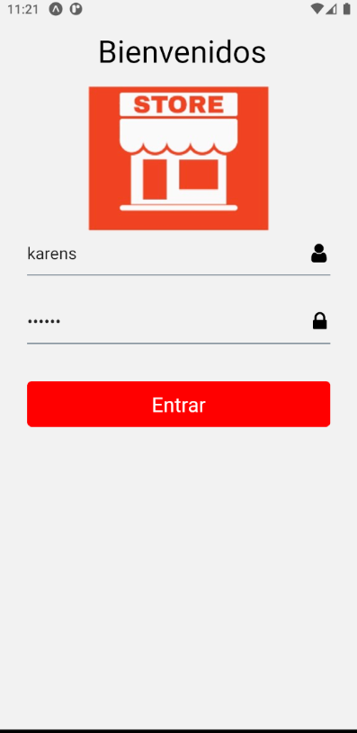
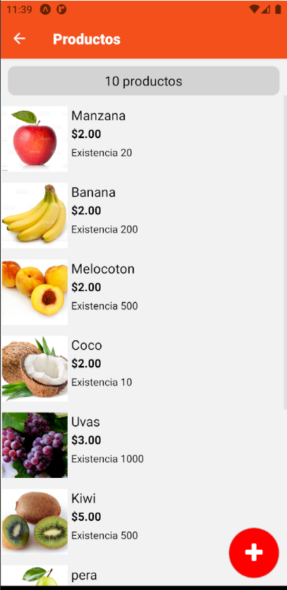

# Guía 10

Los proyectos para esta guía corresponden de la siguiente manera
- **market**: Desarrollo de guía 10

Para probar el proyecto *market*

1. Descargar el repo
2. yarn install
3. yarn start

---

## market

captura 1|captura 2
:---------:|:---------:
|
